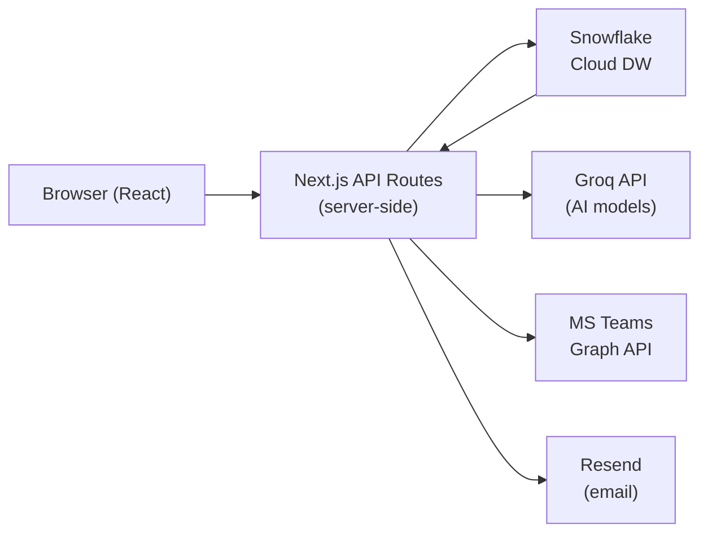

# Architecture — Control Tower Manufacturing

## Overview

Next.js 14 App Router serves as both the frontend (React Server/Client Components) and backend (API Routes). No separate backend process. Snowflake is the sole data warehouse.



## Tech Stack

| Layer | Technology | Version |
|---|---|---|
| Framework | Next.js (App Router) | 14 |
| Language | TypeScript | 5 |
| Styling | Tailwind CSS | 3 |
| Charts | Nivo (`@nivo/line`, `@nivo/bar`) | — |
| Animation | Framer Motion | — |
| Database | Snowflake (`snowflake-sdk`) | — |
| Auth | NextAuth.js + Azure AD provider | — |
| Icons | Lucide React | — |
| Date util | date-fns | — |
| AI (primary) | Groq SDK | — |
| AI (fallback) | Anthropic SDK | — |
| Notifications | MS Teams Graph API + Resend | — |

**Chart library is fixed — do not replace Nivo with Recharts or any other library.**

## Directory Structure

```
app/
├── layout.tsx                      # Root layout (Lato font, global CSS)
├── page.tsx                        # Root redirect (→ /dashboard or /login)
├── globals.css                     # Lato font import, body styles, scrollbar
├── providers.tsx                   # NextAuth SessionProvider wrapper
├── login/page.tsx                  # Login page
├── dashboard/
│   ├── page.tsx                    # Strategic view — main KPI dashboard
│   └── settings/page.tsx           # Settings page
├── lead-time/page.tsx              # Lead Time page (3 views, mock data)
├── monitor/page.tsx                # Fullscreen monitor mode
└── api/
    ├── auth/[...nextauth]/route.ts # NextAuth handler
    ├── auth/teams/token/route.ts   # Teams OAuth token refresh
    ├── cache/revalidate/route.ts   # Cache invalidation endpoint
    ├── chat/route.ts               # AI Analyst chat (streaming)
    ├── dashboard/
    │   ├── kpi/route.ts            # KPI card data (1h cached)
    │   ├── trends/route.ts         # Chart trend data (1h cached)
    │   ├── plants/route.ts         # Plant dropdown options
    │   ├── summary/route.ts        # AI Summary (5h cached)
    │   └── debug/route.ts          # Debug endpoint (blocked in production)
    ├── notifications/
    │   ├── teams/route.ts          # Teams alert sender
    │   └── test/route.ts           # Test notification endpoint
    └── settings/teams/route.ts     # Teams settings persistence

components/
├── dashboard/
│   ├── Header.tsx                  # Universal header — nav, filters, bell, monitor button
│   ├── Sidebar.tsx                 # Sidebar nav + auto-logout
│   ├── KPICard.tsx                 # KPI card with accent bar, animated value, tooltip
│   ├── AISummary.tsx               # AI Summary strip (white card, AILabel chip)
│   ├── AlertPanel.tsx              # Alert rows with dismiss/undo
│   ├── TrendChart.tsx              # Nivo line chart with SPC limits
│   ├── StackedBarChart.tsx         # Nivo bar chart KPI by plant
│   ├── FloatingChat.tsx            # Floating AI Analyst chatbot UI
│   ├── FilterPanel.tsx             # Filter panel (unused externally — integrated in Header)
│   ├── SecurityOverlay.tsx         # Screen-lock overlay (idle security)
│   └── SkeletonCard.tsx            # Loading skeleton
└── monitor/
    ├── StrategicMonitor.tsx        # Strategic monitor layout (self-fetching from Snowflake)
    └── LeadTimeMonitor.tsx         # Lead Time monitor layout (static mock data)

lib/
├── queries.ts                      # All Snowflake SQL queries
├── snowflake.ts                    # Snowflake SDK connection pool
├── alerts.ts                       # Alert threshold logic
├── chartConfig.ts                  # PLANT_COLORS, KPI_OPTIONS, SPC formulas
├── auth.ts                         # NextAuth config + Azure AD
├── ai-models.ts                    # Groq model registry + fallback logic
├── ai-provider.ts                  # AI SDK provider abstraction
├── agent-router.ts                 # Complexity classifier → model selector
├── diagnostic-prompt.ts            # Dynamic system prompt builder
├── chat-history.ts                 # Chat session history (localStorage)
├── graph/teams.ts                  # Teams Graph API (send DM, HTML escaping)
├── alerts/teams.ts                 # Teams alert formatter
├── email.ts                        # Resend email integration
├── settings.ts                     # Settings persistence
├── types.ts                        # Shared TypeScript types
├── i18n.ts                         # Indonesian translation keys
└── utils.ts                        # formatThousands, cn()
```

## API Routes

| Endpoint | Method | Auth | Cache | Purpose |
|---|---|---|---|---|
| `/api/dashboard/kpi` | GET | Required | 1h | KPI card values (all 7 KPIs in one call) |
| `/api/dashboard/trends` | GET | Required | 1h | Chart trend data per period |
| `/api/dashboard/plants` | GET | Required | — | List of plant names for dropdown |
| `/api/dashboard/summary` | GET | Required | 5h | AI executive summary text |
| `/api/chat` | POST | Required | — | Streaming AI chat with tool use |
| `/api/notifications/teams` | POST | Required | — | Send Teams DM alert |
| `/api/settings/teams` | GET/POST | Required | — | Read/write Teams notification settings |
| `/api/cache/revalidate` | POST | Required | — | Invalidate KPI/trend cache |
| `/api/auth/teams/token` | GET | Required | — | Refresh Teams OAuth token |

All API routes call `getServerSession(authOptions)` as their first action. Unauthenticated requests return `401`.

## Data Flow

```
User opens /dashboard
    │
    ├── Header reads localStorage ct-filters (plant, period, dates, dataLevel)
    ├── fetchData() → GET /api/dashboard/kpi?plant=...&startDate=...&endDate=...&period=...
    │       │
    │       └── API route → Snowflake SDK → 7 parallel queries (or cached)
    │               └── JSON response → React state → KPI cards render
    │
    ├── TrendChart → GET /api/dashboard/trends (same filter params)
    ├── AISummary → GET /api/dashboard/summary (cached 5h, same filters)
    └── AlertPanel → computeAlerts() (client-side, from KPI response values)
```

## Authentication Flow

1. User visits `/` → middleware checks session → redirects to `/login` if unauthenticated.
2. Login page: Azure AD OAuth2 via NextAuth.js. User authenticates with corporate Microsoft account.
3. Session stored in signed JWT cookie (NextAuth default).
4. If Azure AD refresh token fails: `session.expires` is set to epoch 0; middleware redirects to `/login?error=SessionExpired`.
5. Every API route verifies session before touching Snowflake.

## Monitor Mode Architecture

The `/monitor` route is a dedicated fullscreen page (not an in-place overlay on `/dashboard`).

**Navigation from dashboard:**
```
Dashboard "monitor" button → router.push('/monitor?page=strategic&plant=...&period=...&startDate=...&endDate=...&dataLevel=...')
Lead Time "monitor" button → router.push('/monitor?page=lead-time')
```

**At `/monitor`:**
- `requestFullscreen()` on mount
- `fullscreenchange` event: if user presses Escape → `router.back()`
- Exit button: `exitFullscreen()` then `router.push(currentPage.exitHref)`
- Bottom navigation bar: clock · filter context · page pills (Strategic / Lead Time) · exit
- `StrategicMonitor` self-fetches data from Snowflake using filters from URL params
- `LeadTimeMonitor` renders static mock data (no fetch)

## Caching Strategy

Two cached wrapper functions in `/api/dashboard/kpi/route.ts`:
- `fetchByPeriod`: keyed by `plant + preset period` — all requests for the same plant+period hit the same cache entry.
- `fetchByDates`: keyed by `plant + startDate + endDate` — custom date ranges.

Both use `unstable_cache` from Next.js with `revalidate: 3600` and tag `"kpi"`.

Cache is in-memory per server instance (not shared across Vercel edge nodes without a Redis adapter).

## AI Architecture

### Providers

Two AI providers are supported. Provider is determined per-model via `lib/ai-models.ts → getProviderForModel()`.

| Provider | SDK | Base URL | Purpose |
|---|---|---|---|
| **DeepSeek** (primary) | `openai` SDK + custom `baseURL` | `https://api.deepseek.com/v1` | Primary for all AI features |
| **Groq** (fallback + additional) | `groq-sdk` | Groq default | Summary fallback, additional chat models |

DeepSeek uses the OpenAI-compatible API. The `openai` SDK is configured with `baseURL: "https://api.deepseek.com/v1"`.
Client factory: `lib/ai-provider.ts → getClientForModel(modelId)`.

### AI Summary (`/api/dashboard/summary`)

Generates a 3-sentence executive summary of current KPI state. Cached 5 hours.

**Summary model priority (fool-proof, fast, low token cost):**
1. `deepseek-chat` — DeepSeek V4, primary (fastest, lowest cost, `max_tokens: 600`)
2. `qwen/qwen3.6-27b` — Groq fallback (one reliable backup)

If DeepSeek is unavailable, the route automatically falls back to Groq. Both providers are tried in order; the first successful response wins.

### AI Analyst Chat (`/api/chat`)

Streaming chat with tool use. Two tools available:
- `get_kpi_data` — runs one of 10 KPI queries against Snowflake
- `get_weekly_trend` — runs one of 8 trend queries

System prompt is built dynamically by `lib/diagnostic-prompt.ts`:
- Active filters (plant, period, dates)
- Live KPI snapshot (actual values + ⚠/✓ vs target flags)
- Active alerts

**Diagnostic framework** (5 steps):
1. OBSERVE — state actual values vs target, size of gap
2. HYPOTHESIZE — propose 1–2 most likely root causes
3. ASK ONE — ask exactly one question to validate hypothesis
4. NARROW — use user's answer to narrow down
5. RECOMMEND — give concrete recommendation only after hypothesis is validated

**Agent router** (`lib/agent-router.ts`): classifies question complexity → selects model tier.
- Simple/moderate questions → `deepseek-chat` (low latency)
- Complex/root-cause/analysis → `deepseek-reasoner` (DeepSeek R1, chain-of-thought)

**Current model registry** (`lib/ai-models.ts`):

| Model ID | Provider | Display name | Use case |
|---|---|---|---|
| `deepseek-chat` | DeepSeek | DeepSeek V4 | Default chat, summary, tool use (fast) |
| `deepseek-reasoner` | DeepSeek | DeepSeek R1 | Complex reasoning, root-cause analysis |
| `qwen/qwen3.6-27b` | Groq | Qwen 3.6 | Summary fallback, fast Groq option |
| `openai/gpt-oss-120b` | Groq | GPT OSS 120B | Large Groq model, deep analysis |
| `groq/compound` | Groq | Groq Compound | Long sessions, no token limit |
| `qwen/qwen3.8-27b` | Groq | Qwen 3.8 | Structured output, Groq option |

All 6 models are available in the FloatingChat model picker.

**Cost controls:** `max_tokens: 1500` per tool round, `1200` for final streaming answer, `MAX_TOOL_ROUNDS = 3`.

**Model fallback:** If a model returns an unavailable error (HTTP 404, `model_not_found`, etc.), the next model in the priority list is tried. Works across both DeepSeek and Groq providers.

## Rate Limiting

Implemented in `middleware.ts`:
- `/api/chat`: 30 req/min per IP
- `/api/dashboard/summary`: 10 req/min per IP
- All other `/api/*`: 120 req/min per IP
- `/api/debug/*`: blocked entirely in production

## Security Headers

Set via `next.config.mjs` on all routes:
- `Content-Security-Policy`
- `X-Frame-Options: DENY`
- `X-Content-Type-Options: nosniff`
- `Strict-Transport-Security`
- `Referrer-Policy: strict-origin-when-cross-origin`
- `Permissions-Policy` (camera/mic/geolocation blocked)
- `Cross-Origin-Opener-Policy: same-origin`
- `Cross-Origin-Resource-Policy: same-origin`

Full security documentation: `docs/SECURITY.md`.

## Environment Variables

| Variable | Required | Purpose |
|---|---|---|
| `SNOWFLAKE_ACCOUNT` | Yes | Snowflake account identifier |
| `SNOWFLAKE_USER` | Yes | Service account username |
| `SNOWFLAKE_PASSWORD` | Yes | Service account password |
| `SNOWFLAKE_DATABASE` | Yes | Target database |
| `SNOWFLAKE_WAREHOUSE` | Yes | Compute warehouse |
| `SNOWFLAKE_SCHEMA` | Yes | Schema name |
| `NEXTAUTH_SECRET` | Yes | 32+ char random string for JWT signing |
| `NEXTAUTH_URL` | Yes | Canonical deployment URL |
| `DEEPSEEK_API_KEY` | Yes (primary AI) | DeepSeek API key — get at platform.deepseek.com |
| `GROQ_API_KEY` | Yes (AI fallback) | Groq API key — fallback for summary + additional chat models |
| `TEAMS_WEBHOOK_URL` | Optional | Power Automate webhook (legacy fallback) |
| `TEAMS_RECIPIENTS` | Optional | JSON array of Teams recipient configs |
| `RESEND_API_KEY` | Optional | Email notification via Resend |
